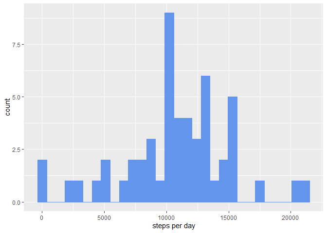
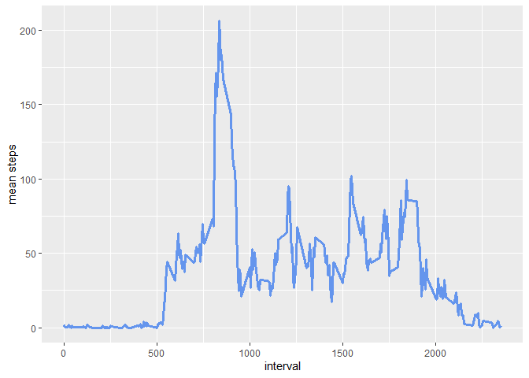
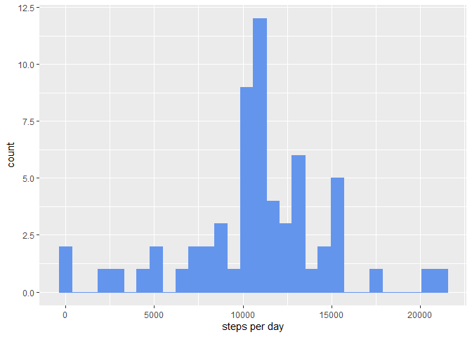
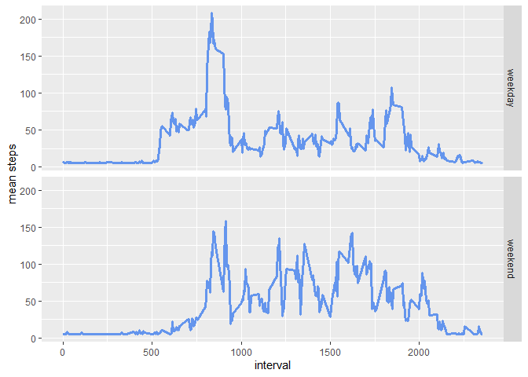

```r
knitr::opts_chunk$set(message = FALSE)
options(scipen=1, digits=2)
```

## Loading and preprocessing the data


```r
unzip("activity.zip")
data <- read.csv("activity.csv", header = TRUE, sep=",", quote = "\"'", na.strings = "NA")
data$date <- as.Date(data$date, format = "%Y-%m-%d")
```


## What is mean total number of steps taken per day?

Here the total number of steps per day is calculated (for every day):

```r
library(dplyr)
```

```
## Warning: package 'dplyr' was built under R version 4.0.3
```

```r
steps <- data %>%
  group_by(date) %>%
  summarize(steps_per_day = sum(steps))
```

Plotting the histogram:

```r
library(ggplot2)
ggplot(steps, aes(steps_per_day)) + geom_histogram(color="cornflowerblue", fill="cornflowerblue") + xlab(label = "steps per day") 
```

```
## Warning: Removed 8 rows containing non-finite values (stat_bin).
```

<!-- -->


```r
mean <- mean(steps$steps_per_day, na.rm = TRUE)
median <- median(steps$steps_per_day, na.rm = TRUE)
```

The mean total number of steps taken per day is 10766.19.
The median total number of steps taken per day is 10765.

## What is the average daily activity pattern?

Time-series plot of the 5-minute inverval and the average number of steps takes, averaged across all days:

```r
interval <- data %>%
  group_by(interval) %>%
  summarize(mean_steps = mean(steps, na.rm = TRUE))

ggplot(interval, aes(x = interval, y = mean_steps)) + geom_line(color="cornflowerblue", size=1.2) + ylab(label = "mean steps")
```

<!-- -->

Calculation of the max_interval:

```r
max_interval <- subset(interval, mean_steps == max(mean_steps, na.rm = TRUE))
max_interval <- max_interval[[1]]
```

In the 835 interval the maximum number of steps where walked.

## Imputing missing values


```r
missing_values <- sum(is.na(data))
```

There are 2304 missing values in the dataset.

Replacing the missing values with the mean of the other values.
(There are only missing values for "steps" not in the other columns.) And creating a new dataset that is eqal to the original but with the missing values filled out.

```r
missing <- is.na(data)
imputed <- data
imputed[missing] <- mean(data$steps, na.rm = TRUE)
```

Preparation for and creation of a new histogram with the dataset of the filled in missing values.

```r
steps_imputed <- imputed %>%
  group_by(date) %>%
  summarize(steps_per_day = sum(steps))

ggplot(steps_imputed, aes(steps_per_day)) + geom_histogram(color = "cornflowerblue", fill="cornflowerblue") + xlab(label = "steps per day")
```

<!-- -->

This plot looks very similar to the original plot.

Calculation of the new mean and median.

```r
mean_imputed <- mean(steps_imputed$steps_per_day)
median_imputed <- median(steps_imputed$steps_per_day)
```

The new mean is 10766.19.
The new median is 10766.19.

The mean has not changed and the median has barly changed.

## Are there differences in activity patterns between weekdays and weekends?

Creation of the factor variable weekday/weekend.

```r
Sys.setlocale("LC_TIME","US")
```

```
## [1] "English_United States.1252"
```

```r
imputed$day <- weekdays(imputed$date)
imputed$day <- sub("Monday|Tuesday|Wednesday|Thursday|Friday", "weekday", imputed$day)
imputed$day <- sub("Saturday|Sunday", "weekend", imputed$day)
imputed$day <- as.factor(imputed$day)
```

Preparation for and plotting of the time series plot:

```r
imputed_interval <- imputed %>%
  group_by(interval,day) %>%
  summarize(mean_steps = mean(steps))

ggplot(imputed_interval, aes(x = interval, y = mean_steps)) + geom_line(color = "cornflowerblue", size=1.2) + facet_grid(rows = vars(day)) + ylab(label="mean steps")
```

<!-- -->

On weekdays the participants walked a bit less. Furthermore they started their activity a little later.
